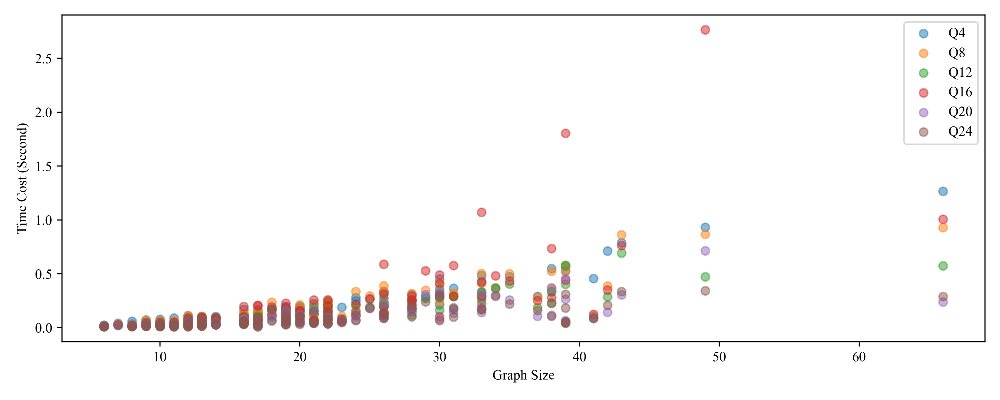
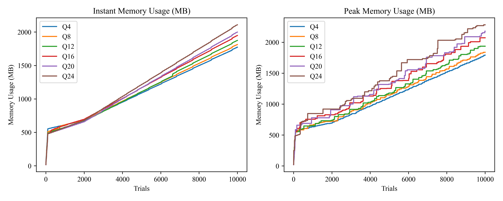
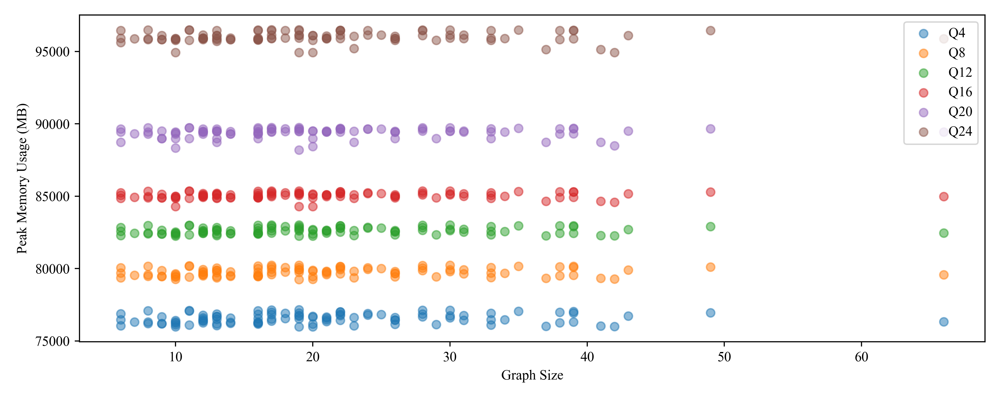

# Ullmann Algorithm

This is a project implementing ullmann algorithm in Python.

File directory:
- `graphDB`: datasets including graphs and queries of different scales.
- `output`: intermediate analysis results.
- `visualize`: visualization of analysis results.
- `graph.py`: data structure of the `Graph`, `Edge`, and `Vertex`.
- `main.py`: main entry to call the ullmann algorithn.
- `memory_analysis.py` and `memory_test.py`: entry to general memory analysis.
- `memory_unit_analysis.py` & `memory_unit_test.py`: entry to unit-style memory analysis.
- `time_test.py`: entry to general time analysis.
- `time_unit_test.py` and `time_unit_analysis.py`: entry to unit-style time analysis.
- `ullmann.py`: implementation of the ullmann algorithm.
- `utils.py`: utilization functions.

## How to Run

Run the basic ullmann functions:
```bash
python main.py
```

Run general time analysis:
```bash
bash run_time_test.sh
```

Run unit-style time analysis:
```bash
bash run_time_unit_test.sh
```
and get the corresponding analysis output in directory `visualize/time_unit_analysis.png`.

Run general memory analysis:
```bash
bash run_memory_test.sh
```
and get the corresponding analysis output in directory `visualize/memory_analysis.png`.

Run unit-style memory analysis:
```bash
bash run_memory_unit_test.sh
```
and get the corresponding analysis output in directory `visualize/memory_unit_analysis.png`.

## Examples

### Main Ullmann Algorithm

```
--------------------------------------------------
Total: 1 matches for 8779688115825 and 8779696574801
[[1. 0. 0. 0. 0. 0. 0. 0. 0. 0. 0. 0. 0. 0. 0. 0. 0. 0.]
 [0. 0. 0. 1. 0. 0. 0. 0. 0. 0. 0. 0. 0. 0. 0. 0. 0. 0.]
 [0. 0. 0. 0. 1. 0. 0. 0. 0. 0. 0. 0. 0. 0. 0. 0. 0. 0.]
 [0. 0. 0. 0. 0. 0. 1. 0. 0. 0. 0. 0. 0. 0. 0. 0. 0. 0.]
 [0. 0. 0. 0. 0. 0. 0. 0. 0. 1. 0. 0. 0. 0. 0. 0. 0. 0.]]
--------------------------------------------------
```
Here `8779688115825` and `8779696574801` represents for hashed graph and qurey instances.

### General Time Test
|      | Q4                            | Q8                          | Q12                           | Q16                         | Q20                        | Q24                        |
| ---- | ----------------------------- | --------------------------- | ----------------------------- | --------------------------- | -------------------------- | -------------------------- |
| Time | $169.35  {\tiny \pm 2.875}$ | $149.28 {\tiny \pm 2.419}$ | $140.09 {\tiny \pm 2.621}$ | $136.72 {\tiny \pm 2.817}$ | $84.88 {\tiny \pm1.928} $ | $84.89 {\tiny \pm 2.108}$ |

### Unit-style Time Test



### General Memory Test



### Unit Style Memory Test

